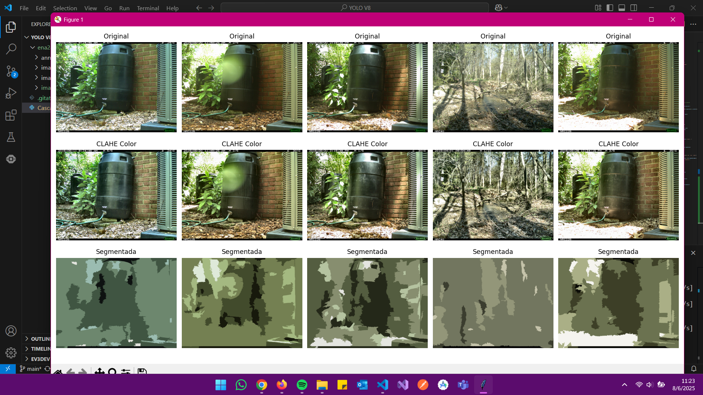

Este proyecto tiene como objetivo replicar la metodología propuesta en el artículo "Novel Animal Detection System: Cascaded YOLOv8 With Adaptive Preprocessing and Feature Extraction" para la detección de animales salvajes. A continuación, se detallan los pasos implementados hasta la fecha.

1. Configuración Inicial del Entorno y Descarga de Datos

    Descripción: Preparación del entorno de trabajo (Visual Code Python) y gestión de los datos iniciales.
        Instalación de librerías esenciales en Python (Ultralytics, OpenCV, Scikit-image, Scikit-learn, TensorFlow).
        Definición de directorios para la organización de los datos de entrada y salida.
        Descarga y filtrado de metadatos del dataset ENA24 (o similar a COCO) para identificar imágenes que contienen "cuadrúpedos".
        Descarga de un subconjunto de imágenes filtradas (ej. 100 imágenes) para las fases iniciales de prueba y desarrollo.

2. Preprocesamiento Adaptativo: Ecualización de Histograma Adaptativa (AHE)

    Descripción: Mejora del contraste de las imágenes para optimizar las etapas posteriores de segmentación y extracción de características.
        Implementación de CLAHE (Contrast Limited Adaptive Histogram Equalization).
        Aplicación de CLAHE al canal de luminancia (L*) de las imágenes a color (BGR -> LAB -> L* con CLAHE -> LAB -> BGR), preservando la información cromática original.
        Guardado de las imágenes preprocesadas en un directorio específico (ena24/images_ahe_color).

3. Segmentación Basada en Superpíxeles

    Descripción: División de las imágenes preprocesadas en regiones coherentes (superpíxeles) y agrupación de estas regiones para facilitar la identificación de objetos.
        Uso de SLIC (Simple Linear Iterative Clustering) de scikit-image para la generación de superpíxeles.
        Implementación de MiniBatchKMeans de scikit-learn como sustituto y aproximación de Fast Fuzzy C-Means (FCM) para agrupar las características de los superpíxeles en regiones distintas.
        Ajuste iterativo de parámetros (n_segments, compactness para SLIC; n_clusters para MiniBatchKMeans) para optimizar la separación de objetos (ej. animales pequeños de fondos complejos).
        Guardado de las imágenes segmentadas en un directorio (ena24/images_segmented).
        Implementación de utilidades de visualización para inspeccionar la calidad de la segmentación.

     

    
    

5. Extracción de Características

    
